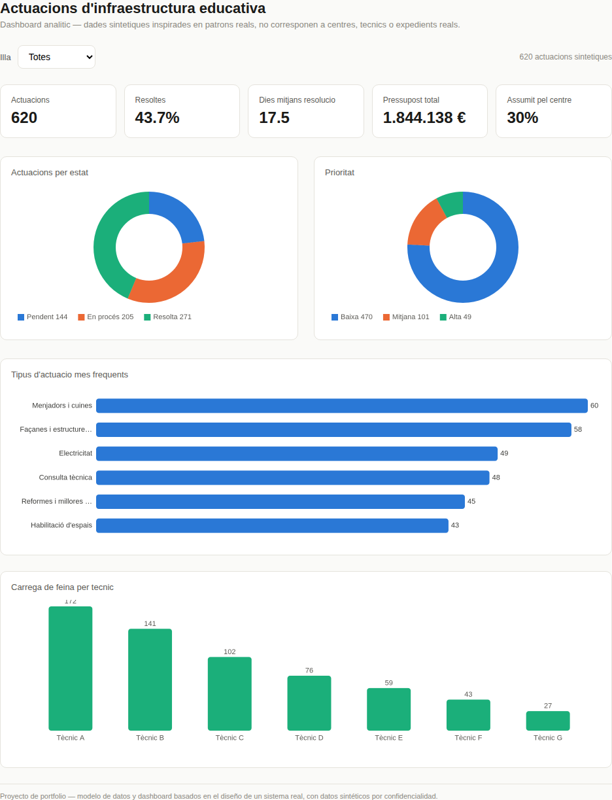

# SIE Balears — Sistema de gestión de actuaciones de infraestructura educativa

Case study de mi paso por **AYESA**, trabajando para la **Conselleria d'Educació i Universitats** del Govern de les Illes Balears, en el área de obras del sistema de gestión de actuaciones de infraestructura en centros educativos (INTERDGPC / SIE).

> **Nota de confidencialidad.** Este repositorio no contiene código fuente, credenciales, datos de producción, capturas de pantalla originales ni información de personas reales. El modelo de datos (esquema de tablas y relaciones) se muestra porque describe una arquitectura, no información confidencial. Todo dato mostrado en el dashboard es **sintético**, generado a partir de distribuciones estadísticas razonables, no de registros reales.

## Contexto

La Conselleria d'Educació gestiona la infraestructura de más de 850 centros educativos repartidos en las cuatro islas. Antes de la digitalización de este flujo, cada solicitud —desde una avería puntual hasta una obra de ampliación financiada por convenio con un ayuntamiento— se tramitaba por email y hojas de cálculo, sin trazabilidad ni visibilidad agregada.

El proyecto en el que participé cubre dos frentes relacionados:

1. **Gestión de actuaciones "del día a día"** (incidencias, reparaciones, consultas técnicas de los propios centros).
2. **Plan de Infraestructuras**, un proceso anual con un flujo de aprobación en 5 fases, distintos perfiles con distintos permisos, y una integración con **IBISEC** (el ente público que ejecuta las obras mayores) para sincronizar el estado real de los expedientes licitados.

## Mi rol

Participé en el diseño e implementación del modelo de datos y del flujo de negocio que sostiene este sistema: modelado relacional, definición de la máquina de estados, especificación de la integración con sistemas externos y traducción de los requisitos funcionales de la Conselleria a un modelo técnico sostenible.

## 1. Arquitectura de datos

Modelo relacional normalizado (MySQL/MariaDB), con un núcleo de `actuaciones` rodeado de catálogos (tipos, prioridades, orígenes/destinos) y dos módulos satélite: geográfico (illa → municipi → centre) y de convenios con ayuntamientos.

Ver diagrama completo → [`docs/er-diagram.md`](docs/er-diagram.md)

## 2. El flujo de una actuación

El sistema modela dos flujos relacionados que comparten la misma base de datos:

**Gestión de incidencias del día a día** — una máquina de estados de tres niveles (superestado → estado → subestado) que va de `Pendent` a `Resolta`, con ramas específicas para lo que se deriva a IBISEC (previsió → licitació → garantia → execució → acabat).

**Plan de Infraestructuras (anual)** — un proceso en 5 fases con actores distintos en cada una:

| Fase | Qué ocurre | Quién actúa |
|---|---|---|
| 1 | Se crean las propuestas de actuación | Delegaciones territoriales |
| 2 | Se filtran las propuestas viables → "en estudio" | Servicios centrales |
| 3 | Visita técnica, se valida presupuesto y descriptor → "en trámite" | Equipo técnico de infraestructuras |
| 4 | Decisión final: programada / aplazada / descartada | Servicios centrales |
| 5 | Cierre del ciclo anual | Servicios centrales |

El cambio de fase es una operación **por lotes**: todas las propuestas activas avanzan de fase a la vez, lo que simplifica el ciclo de vida del proceso frente a que cada expediente avance de forma independiente.

Ver diagrama de estados ampliado → [`docs/state-machine.md`](docs/state-machine.md)

## 3. Modelo de permisos por perfil

El acceso está controlado por perfil, no por usuario individual, y varía según la fase del proceso — el mismo perfil puede tener permiso de edición en una fase y solo lectura en otra. A grandes rasgos:

- **Delegaciones territoriales**: crean y editan propuestas en su ámbito (fase 1), consultan en el resto.
- **Servicios centrales**: permisos completos en todas las fases — son quienes deciden qué avanza y qué se descarta.
- **Equipo técnico de infraestructuras**: permisos de edición de presupuesto/descriptor concentrados en la fase de validación técnica (fase 3), lectura en el resto.

Este diseño (permisos como función de `perfil × fase`, no solo `perfil`) evita tener que crear un perfil distinto por cada combinación posible y hace explícito, en la propia matriz, quién es responsable de qué en cada momento del proceso — algo muy útil de cara a auditoría.

## 4. Integración con sistemas externos

Las actuaciones que se derivan a un organismo ejecutor externo necesitan reflejar el estado real del expediente en ese sistema (licitación, adjudicación, ejecución, cierre), para que el centro educativo no tenga que llamar por teléfono para preguntar "¿cómo va mi obra?".

La solución fue una integración vía **web service REST**, con sincronización periódica (diaria) que trae al sistema los campos relevantes del expediente externo: código de expediente, estado, importes (proyecto, adjudicación, certificado, facturado), fechas clave del ciclo de contratación (adjudicación, formalización, recepción, liquidación, fin de garantía) y la empresa adjudicataria.

Un matiz de diseño relevante: el estado del expediente externo **no sustituye** al estado interno de la actuación, se mapea a un subestado propio (`Derivar IBISEC → previs → licitació → garantia → execució → acabat`), de forma que el centro sigue viendo un único flujo coherente en vez de tener que interpretar el vocabulario de dos sistemas distintos.

## 5. Dashboard analítico

Para ilustrar qué tipo de lectura habilita este modelo de datos bien estructurado, construí un dashboard interactivo con datos **sintéticos** (no reales): actuaciones por isla, tiempo medio de resolución, carga de trabajo por técnico y ejecución presupuestaria.



Ver versión interactiva → [`docs/dashboard.html`](docs/dashboard.html) (ábrelo en el navegador, requiere conexión a internet para cargar Chart.js)

## Stack

- **Base de datos**: MySQL / MariaDB, modelo relacional normalizado
- **Backend/negocio**: máquina de estados jerárquica, control de acceso basado en perfil × fase
- **Integraciones**: consumo de web service REST externo, sincronización periódica
- **Analítica**: modelado dimensional para reporting (por isla, municipio, tipo de actuación, técnico)

## Sitio publicado

→ **[gdaguerre.github.io/sie-baleares-case-study](https://tuusuario.github.io/sie-baleares-case-study/)** *(reemplazar con tu URL real de GitHub Pages)*

## Estructura del repositorio

```
sie-baleares-case-study/
├── README.md                  este documento
├── assets/
│   └── dashboard.png          captura para este README
└── docs/                      publicado vía GitHub Pages
    ├── index.html             portada del case study
    ├── dashboard.html         dashboard interactivo (datos sintéticos)
    ├── er-diagram.md          modelo entidad-relación (Mermaid)
    ├── state-machine.md       flujo de estados y fases (Mermaid)
    ├── permisos.md            matriz de permisos por perfil × fase
    └── assets/
        └── dashboard.png      misma captura, copiada aquí para que Pages pueda servirla
```

