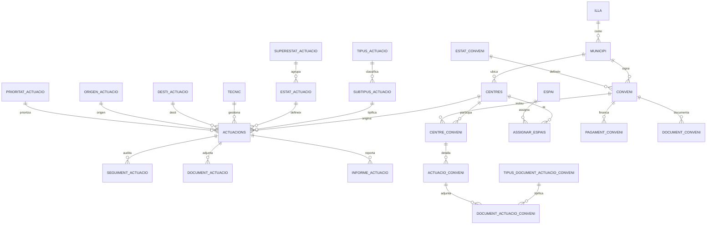

# Modelo entidad-relación

Extraído y simplificado a partir del esquema real de la base de datos (nombres de tabla y relaciones; sin datos).

## Lectura del modelo

- **Núcleo (`ACTUACIONS`)**: cada solicitud de obra o incidencia. Referencia a centro, técnico asignado, estado, prioridad, tipo/subtipo, origen y destino.
- **Módulo geográfico** (`ILLA` → `MUNICIPI` → `CENTRES`): permite agregar cualquier métrica por territorio, clave en un archipiélago con capacidades de respuesta muy distintas entre islas.
- **Máquina de estados** (`SUPERESTAT_ACTUACIO` → `ESTAT_ACTUACIO`): jerarquía de dos niveles que permite tanto una vista simple ("pendiente / en proceso / resuelta") como el detalle operativo real.
- **Módulo de convenios**: financiación de obras mayores junto con ayuntamientos, en paralelo al flujo de actuaciones, con sus propios documentos y pagos.
- **Trazabilidad**: `SEGUIMENT_ACTUACIO`, `DOCUMENT_ACTUACIO` e `INFORME_ACTUACIO` permiten reconstruir el historial completo de cualquier expediente.
