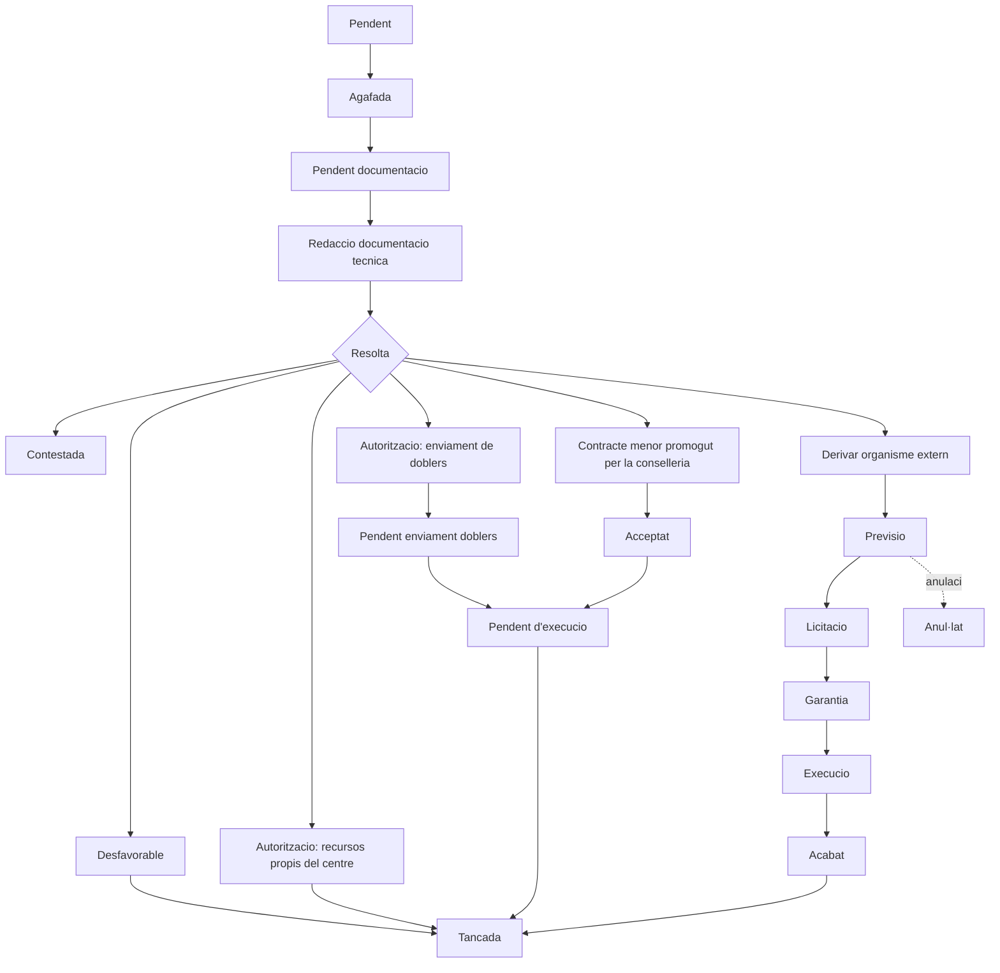
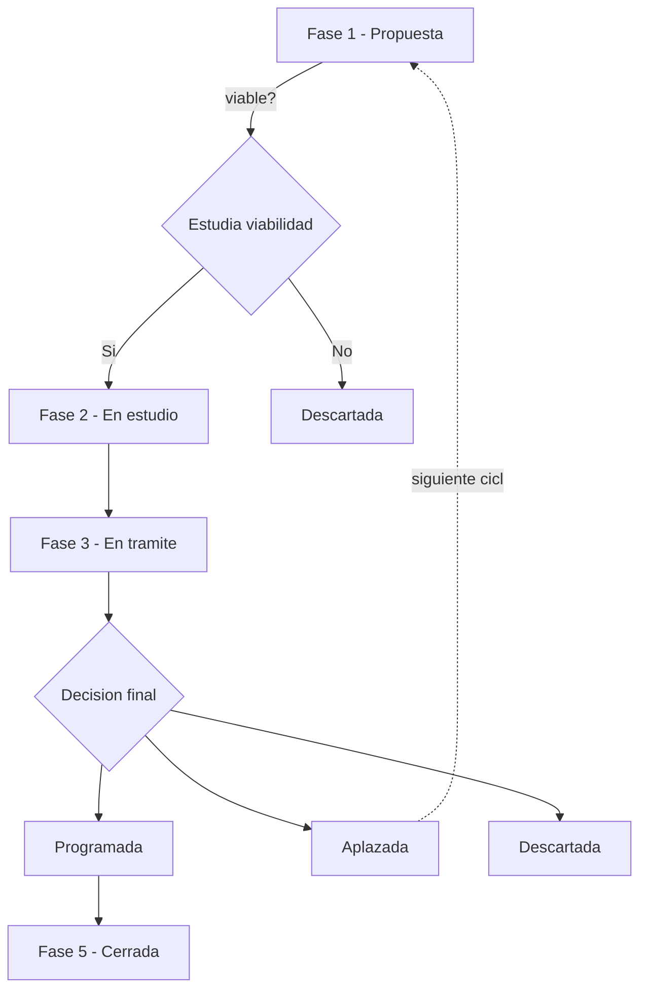

# Flujo de estados

El sistema modela dos procesos relacionados que comparten estructura: la **gestión de incidencias del día a día** y el **Plan de Infraestructuras anual**.

## Gestión de incidencias

Diagrama simplificado. La rama derecha representa las actuaciones derivadas a un organismo ejecutor externo, cuyo estado se sincroniza vía integración periódica.

**Decisión de diseño clave**: el estado del sistema externo no sustituye al estado interno — se mapea a un subestado propio (`Derivar organisme extern → previsió → licitació → garantia → execució → acabat`). Así el centro educativo consulta siempre un único flujo coherente, sin tener que interpretar el vocabulario de dos sistemas distintos.

## Plan de Infraestructuras (ciclo anual)

Proceso en 5 fases con cambio de fase **por lotes**: todas las propuestas activas avanzan juntas, no de forma individual.

- **Fase 1**: las delegaciones territoriales crean las propuestas.
- **Fase 2**: servicios centrales filtran las propuestas viables para su estudio.
- **Fase 3**: el equipo técnico visita los centros, valida presupuesto y descriptor.
- **Fase 4**: servicios centrales deciden programada / aplazada / descartada.
- **Fase 5**: cierre del ciclo hasta el año siguiente.

Las propuestas aplazadas vuelven a pasar por todas las fases en el ciclo siguiente.
